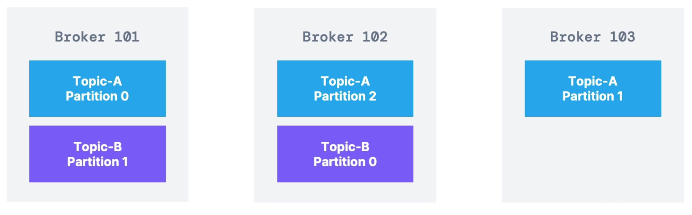

# Kafka Theory
## Topic
- Topic is a particular stream of data
- Like a table in the database
- You can have as many topics as you want
- A topic is identified by its name
- Topic supports any kind of message format
- The sequence of messages is called **data stream**
- You cannot query topics, instead, use Kafka Producers to send data and Kafka Consumers to read the data

## Partitions and Offsets

- Once the data is written to a partition, it cannot be changed (*immutability*)
- Data is kept only for a limited time (default is one week - configurable)
- Offset only have a meaning for a specific partition
- Order is guaranteed only within a partition (not across)

## Producer

- Producers write data to topics (which are made of partitions)
- Producers know to which partition to write to (and which Kafka broker has it)
- In case of Kafka broker failures, Producers will automatically recover

### Message keys
- Producers can choose to send a key with the message (string, number, binary, etc.)
- If key = null, data is sent round robin (partition 0, then 1, then 2...)
- if key != null, then all messages for that key will always go to the same partition (hashing)

### Kafka message anatomy

### Message Serializer

- Kafka only accepts bytes as an input from producers and sends bytes out as an output to consumers
- Message Serialization means transforming objects / data into bytes
- They are used on the value and the key
- Common Serializers
  - String (incl. JSON)
  - Int, Float
  - Avro
  - Protobuf

### Message Key Hashing

- Kafka partitioner is a code logic that takes a record and determines to which partition to send it into
- Key Hashing is the process of determining the mapping of a key to a partition
- In th default Kakfa partitioner, the keys are hashed using the murmur2 algorithm

## Consumers

- Consumers read data from a topic (identified by name)
- Consumers automatically know which broker to read from
- In case of broker failure, consumers know how to recover
- Data is read in order from low to high offset within each partitions

### Consumer Deserializer

- Deserialize indicates how to transform byte into objects/data
- They are used on the value and the key of the message
- Common Deserializer
  - String (incl. Json)
  - Int, Float
  - Avro
  - Protobuf
- The serialization/deserialization type must not change during a topic lifecycle (create a new topic instead)

## Consumer Groups

- All the consumers in an application read data as a consumer groups
- Each consumer within a group reads from exclusive partitions

### What if too many consumers?

- If you have more consumers than partitions, some consumers will be inactive

### Multiple Consumer Groups on one topic

- In Apache Kafka it is acceptable to have multiple consumer groups on the same topic
- To create distinct consumer groups, use the consumer property **group.id**

### Consumer Offsets

- Kafka stores the offsets at which a consumer group has been reading
- The offsets committed are in Kafka topic names **__consumer_offsets**
- When a consumer in a group has processed data received from Kafka, it should be **periodically* committing the offsets (the Kafka broker will write to __consumer_offsets, not the group itself)
- If a consumer dies, it will be able to read back from where it left off

### Delivery semantics
- There are 3 delivery semantics if you choose to commit
  - **At least once**
    -  Offsets are committed after the message is processed
    - If the processing goes wrong, the message will be read again
    - This can result in duplicate processing of messages
  - **At most once**
    - Offsets are committed as soon as messages are received
    - If the processing goes wrong, some messages will be lost (because they won't be read again)
  - **Exactly once**
    - For Kafka -> Kafka workflows: use the Transactional API (easy with Kafka Streams API)
    - For Kafka -> External System workflows: use an idempotent consumer

## Kafka Brokers

- A Kafka cluster is composed of multiple brokers ( servers)
- Each broker is identified with its ID (integer)
- Each broker contains certain topic partitions
- After connecting to any broker (called a bootstrap broker), you will be connected to the entire cluster (Kafka clients have smart mechanics for that)
- A good number to get started is 3 brokers, but some big clusters have over 100 brokers

### Brokers and topics

- Example of Topic-A with 3 partitions, and Topic-B with 2 partitions
- Note: Data is distributed, and Broker 103 doesn't have any Topic-B data

### Kafka Broker discovery

- Every Kafka broker is also called a bootstrap server
- That means that you only need to connect to one broker, and the Kafka clients will know how to be connected to the entire cluster
- Each broker knows about all brokers, topics and partitions (metadata)

### Topic replication factor
- Topics should have a replication factor > 1 (usually between 2 and 3)
- This way if a broker is down, another broker can serve the data
- Example: Topic-A with 2 partitions and replication factor of 2

### Concept of Leader for a Partition

- At any time only ONE broker can be a leader for a given partition
- Producers can only send data to the broker that is leader of a partition
- The other brokers will replicate the data
- Therefore, each partition has one leader and multiple ISR (in-sync replica)

#### Default producer & Consumer behavior with leaders
- Kafka Producers can only write to the leader broker for a partition
- Kafka Consumers by default will read from the leader broker for a partition

#### Kafka Consumer Replica Fetching (Kafka v2.4+)

- Since Kafka 2.4, it is possible to configure consumers to read from the closest replica
- This may help improve latency, and also decrease network costs if using the cloud

### Producer Acknowledgements (acks)
- Producers can choose to receive acknowledgement of data writes
  - acks = 0: Producer won't wait for acknowledgement (possible data loss)
  - acks = 1: Producer will wait for leader acknowledgement (limited data loss)
  - acks = all: Leader + replicas acknowledgement (no data loss)

### Topic Durability
- For a topic replication factor of 3, topic data durability can withstand 2 brokers loss
- As a rule, for a replication factor of N, you can permanently lose up to N-1 brokers and still recover your data

## Zookepper
- Zookeeper manages brokers (keeps a list of them)
- Zookeeper helps in performing leader election for partitions
- Zookeeper sends notifications to Kafka in case of changes (e.g new topic, broker dies, broker comes up, delete topics, etc.)
- Kafka v2.x can't work without Zookeeper
- Kafka v3.x can work without Zookeeper (KIP-500) - using Kafka Raft instead
- Zookeeper by design operates with an odd number of servers (1,3,5,7,...)
- Zookeeper has a leader (write) and the rest of the servers are followers (reads)

### Kafka KRaft
- In 2020, the Apache Kafka project started to work to remove the Zookeeper dependency
- Zookeeper shows scaling issues when Kafka clusters have > 100.000 partitions
- By removing Zookeeper, Apache Kafka can
  - Scale to millions of partitions, and becomes easier to maintain and set-up
  - Improve stability, makes it easier to monitor, support and administer
  - Single security model for the whole system
  - Single process to start with Kafka